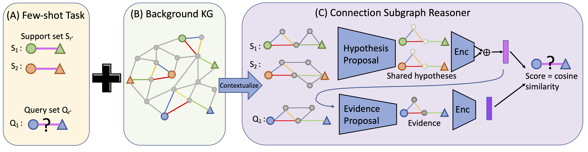
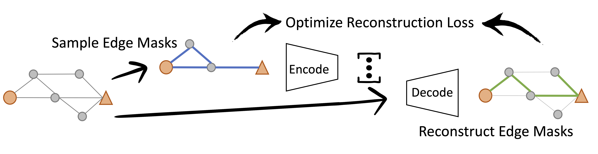

# Few-shot Relational Reasoning via Connection Subgraph Pretraining (NeurIPS 2022)

We propose Connection Subgraph Reasoner (CSR) to make predictions for the few-shot relational reasoning task directly by self-supervised pre-training over knowledge graphs. 



Specifically, we design a self-supervised pretraining scheme with the objective of reconstructing automatically sampled connection subgraphs. 

<p align="center">
  
</p>

## Requirements

To install requirements:

```setup
pip install -r requirements.txt
```

To get NELL, FB15K-237 and ConceptNet data, including raw triplets, preprocessed data, embedding and checkpoints: https://drive.google.com/drive/folders/1HKrC4dr6JJDVhO8dqBkH2ixTejmAhh6e?usp=sharing

To replicate the preprocessing of the data from the raw triplets:
1. Extract subgraphs using `python graph_extractions/graph_sampler.py`. 
2. Preprocess each dataset by running `SubgraphFewshotDataset` in `load_kg_dataset.py` with `preprocess/preprocess_50negs = True`. 

See more detailed configurations and examples inside `graph_extractions/graph_sampler.py`.

## Training

The main files are `model.py` that contains our models and `trainer.py` that contains our training code.

Usages: 

To train CSR-GNN on NELL transductive setting:
```
python main.py --device 0 --wandb_name <wandb_name> --prefix CSR-NELL-GNN --dataset NELL --step pretrain --learning_rate 1e-5 --use_atten True  --coefficient 0.7 --coefficient2 0.1 --use_pretrain_node_emb True
```

To train CSR-GNN on NELL inductive setting:
```
python main.py --device 0 --wandb_name <wandb_name> --prefix CSR-NELL-inductive-GNN --dataset NELL --step pretrain --learning_rate 1e-5 --use_atten True  --coefficient 0.7 --coefficient2 0.1 --inductive True 
```


<details>
<summary>Commands for Other Datasets</summary>

To train CSR-GNN on FB15K-237 transductive setting:
```
python main.py --device 0 --wandb_name <wandb_name> --prefix CSR-FB-GNN --dataset FB15K-237 --step pretrain --learning_rate 1e-5 --use_atten True  --coefficient 0.1 --coefficient2 1 --use_pretrain_node_emb True
```

To train CSR-GNN on FB15K-237 inductive setting:
```
python main.py --device 0 --wandb_name <wandb_name> --prefix CSR-FB-inductive-GNN --dataset FB15K-237 --step pretrain --learning_rate 1e-5 --use_atten True  --coefficient 2 --coefficient2 2 --inductive True 
```


To train CSR-GNN on ConceptNet transductive setting:
```
python main.py --device 0 --wandb_name <wandb_name> --prefix CSR-CN-GNN --dataset ConceptNet --step pretrain --learning_rate 1e-5 --use_atten True  --coefficient 1 --coefficient2 0.5 --use_pretrain_node_emb True --embed_model ComplEx
```

To train CSR-GNN on ConceptNet inductive setting:
```
python main.py --device 0 --wandb_name <wandb_name> --prefix CSR-CN-inductive-GNN --dataset ConceptNet --step pretrain --learning_rate 1e-5 --use_atten True  --coefficient 2 --coefficient2 0.5 --inductive True --embed_model ComplEx
```
</details>

## Evaluation and Pre-trained Models

Pretrained models can be found under `checkpoints/` after downloading. Bellow are example commands for evaluation with NELL datasets and NELL pretrained models:

CSR-GNN on NELL transductive setting:
```
python main.py --device 0 --wandb_name <wandb_name> --prefix CSR-NELL-GNN --dataset NELL --step test --use_atten True --use_pretrain_node_emb True --prev_state_dir checkpoints/CSR-NELL-GNN.pt

```

CSR-GNN on NELL inductive setting:
```
python main.py --device 0 --wandb_name <wandb_name> --prefix CSR-NELL-GNN --dataset NELL --step test --use_atten True --inductive True --prev_state_dir checkpoints/CSR-NELL-inductive-GNN.pt

```

## CSR-OPT


CSR-OPT on NELL inductive setting with hyperparameter tuning:
```
python main.py --device 0 --wandb_name <wandb_name>  --prefix CSR-NELL-inductive-OPT --dataset NELL --step tune

```


CSR-OPT on NELL inductive setting with pre selected hyperparameters:
```
python main.py --device 0 --wandb_name <wandb_name>  --prefix CSR-NELL-inductive-OPT --dataset NELL --step opt_test

```

<!-- ## Pre-trained Models
To get NELL pretrained checkpoints:


CSR-GNN on NELL transductive setting:
```
python main.py --device 0 --wandb_name <wandb_name> --prefix CSR-NELL-GNN --dataset NELL --step test --use_atten True --use_pretrain_node_emb True --prev_state_dir checkpoints/CSR-NELL-GNN.pt

```


CSR-GNN on NELL inductive setting:
```
python main.py --device 0 --wandb_name <wandb_name> --prefix CSR-NELL-GNN --dataset NELL --step test --use_atten True --inductive True --prev_state_dir checkpoints/CSR-NELL-inductive-GNN.pt

``` -->


<!-- CSR-GNN on FB15K-237 transductive setting:
```
python main.py --device 0 --wandb_name <wandb_name> --prefix CSR-FB-GNN --dataset FB15K-237 --step test --use_atten True --use_pretrain_node_emb True --prev_state_dir checkpoints/CSR-FB-GNN.pt
```


CSR-GNN on FB15K-237 inductive setting:
```
python main.py --device 0 --wandb_name <wandb_name> --prefix CSR-FB-GNN --dataset FB15K-237 --step test --use_atten True --inductive True --prev_state_dir checkpoints/CSR-FB-inductive-GNN.pt

```

CSR-GNN on ConceptNet transductive setting:
```
python main.py --device 0 --wandb_name <wandb_name> --prefix CSR-CN-GNN --dataset ConceptNet --step test --use_atten True --use_pretrain_node_emb True --embed_model ComplEx --prev_state_dir checkpoints/CSR-CN-GNN.pt
```

CSR-GNN on ConceptNet inductive setting:
```
python main.py --device 0 --wandb_name <wandb_name> --prefix CSR-CN-inductive-GNN --dataset ConceptNet --step test --use_atten True --inductive True --embed_model ComplEx --prev_state_dir checkpoints/CSR-CN-inductive-GNN.pt
``` -->


## Results
Our model achieves the following performances:

| Dataset | Model name         | transductive MRR| inductive MRR  |
| -------| ------------------ |---------------- | -------------- |
| NELL   | CSR-OPT            |     0.463       |      0.425     |
|        | CSR-GNN            |     0.577       |      0.511     |
| FB15K-237 | CSR-OPT            |     0.619       |      0.554     |
|           | CSR-GNN            |     0.781       |      0.624     |
| ConceptNet  | CSR-OPT            |     0.559       |      0.547     |
|             | CSR-GNN            |     0.606       |      0.611     |

See full results in our paper.
